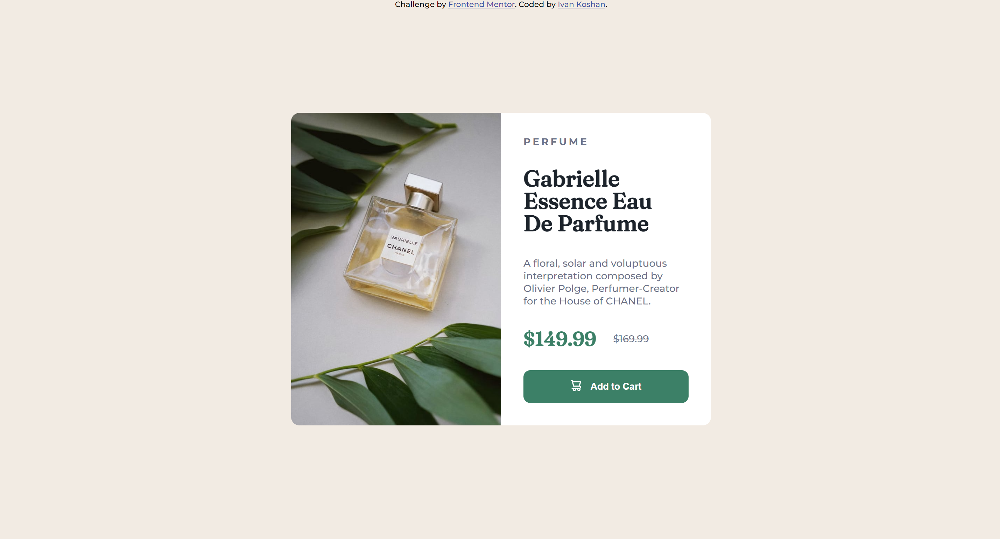

# Frontend Mentor - Product preview card component solution

This is a solution to the [Product preview card component challenge on Frontend Mentor](https://www.frontendmentor.io/challenges/product-preview-card-component-GO7UmttRfa). Frontend Mentor challenges help you improve your coding skills by building realistic projects. 

### The challenge

Users should be able to:

- View the optimal layout depending on their device's screen size
- See hover and focus states for interactive elements

### Screenshot

Desktop Solution

Mobile Solution

### Links

- Live Site URL: (https://ivankoshan2004.github.io/frontendmentor-product-preview-card-component-main/)

### Built with

- CSS custom properties
- CSS Grid

## Author

- Frontend Mentor - [@IvanKoshan2004](https://www.frontendmentor.io/profile/IvanKoshan2004)

